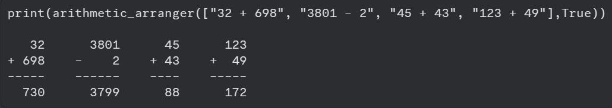

# What is Arithmetic Calculator ?
Arithmetic calculator is a project that resolve four arithmetic problems at once, facilitating the activities of the day and exhibiting the results at way we are accustomed (vertically). 
This is still a prototype, but this is powerful for the business that needs accuracy and speed at the moment of giving change and can be used in every type of finances.

## Usage Rules 
At the first moment it will be needed to follow some rules:
1. The function has two parameters, in the first you should insert a list of operations and to show the results add True as the final parameter. 
2. Don't put more of four arithmetic problems;
3. The limit of digits, for each  operand, is four;
4. For now, the only accepted operators are sum and substraction.

## Upcoming updates
In the future, new tools will be added, being them:
1. Possibility of inserction of more digits at the operations;
2. New mathematical operators (at the beginning it will be inserted division and multiplication).

## Input model and expected results

